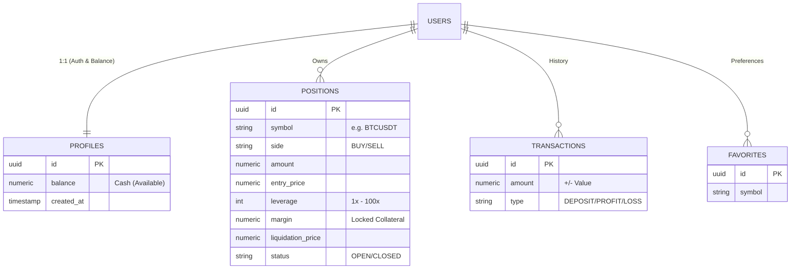

## 🗄️ Database Schema & Architecture

The trading platform relies on a robust **PostgreSQL** architecture (via Supabase). The schema is designed for high-frequency CFD trading, focusing on financial integrity, leverage management, and strict data segregation using Row Level Security (RLS).

### 🗺️ Entity Relationship Diagram (ERD)



---

### 🗃️ Table Reference

#### 1. `profiles`

**Role:** The single source of truth for the user's cash balance.

* **Update Mechanism:** Automated via Database Triggers (see *Automation*).

| Column | Type | Description |
| --- | --- | --- |
| `id` | `uuid` (PK) | Primary Key. Links 1:1 with `auth.users`. |
| `balance` | `numeric` | **Cash Balance.** Does not include unrealized PnL from open positions. |
| `created_at` | `timestamptz` | Account creation timestamp. |

#### 2. `positions`

**Role:** Stores active and historical CFD trades. The frontend `AccountManager` uses active rows (`status='OPEN'`) to calculate real-time **Equity** and **Free Margin**.

| Column | Type | Description |
| --- | --- | --- |
| `id` | `uuid` (PK) | Unique Position ID. |
| `user_id` | `uuid` (FK) | Owner of the position. |
| `symbol` | `text` | Asset Pair (e.g., `ETHUSDT`). |
| `side` | `text` | Direction: `'BUY'` (Long) or `'SELL'` (Short). |
| `amount` | `numeric` | Size of the position in base asset. |
| `entry_price` | `numeric` | Price at execution. |
| `leverage` | `int` | Leverage multiplier (e.g., `20`, `50`, `100`). |
| `margin` | `numeric` | **Collateral.** Calculated as `(amount * entry_price) / leverage`. |
| `liquidation_price` | `numeric` | Stop-out price calculated at entry. |
| `take_profit` | `numeric` | (Optional) Auto-close target. |
| `stop_loss` | `numeric` | (Optional) Max loss target. |
| `status` | `text` | `'OPEN'` or `'CLOSED'`. |
| `pnl` | `numeric` | Realized Profit/Loss (only populated when closed). |
| `exit_price` | `numeric` | Execution price at closure. |

#### 3. `transactions`

**Role:** An immutable ledger of all financial movements.

* **Security:** Read-only for users. Only the system can insert rows.

| Column | Type | Description |
| --- | --- | --- |
| `id` | `uuid` (PK) | Unique Transaction ID. |
| `user_id` | `uuid` (FK) | Owner. |
| `amount` | `numeric` | Change value. Negative for loss/withdraw, positive for profit/deposit. |
| `type` | `text` | Enum: `'DEPOSIT'`, `'WITHDRAWAL'`, `'REALIZED_PNL'`, `'FUNDING_FEE'`. |
| `reference_id` | `uuid` | (Optional) ID of the `position` that generated this event. |
| `created_at` | `timestamptz` | Ledger timestamp. |

#### 4. `favorites`

**Role:** User watchlist preferences.

* **Constraint:** A user cannot favorite the same symbol twice (`unique(user_id, symbol)`).

| Column | Type | Description |
| --- | --- | --- |
| `id` | `uuid` (PK) | Unique ID. |
| `user_id` | `uuid` (FK) | Owner. |
| `symbol` | `text` | Symbol identifier. |

---

### 🔐 Security & RLS (Row Level Security)

The database enforces strict data segregation using PostgreSQL RLS policies. No user can access another user's financial data.

* **`profiles`**: Users can view their own profile. Balance updates are restricted to system triggers.
* **`positions`**: Users can full CRUD (Create, Read, Update, Delete) their *own* positions.
* **`transactions`**: Users have **Read-Only** access to their own history.
* **`favorites`**: Full CRUD access for the owner.

---

### ⚙️ Automation & Triggers

To ensure financial consistency, the `balance` field in `profiles` is never updated manually by the client application.

**Trigger: `on_transaction_created**`

* **Event:** `AFTER INSERT` on `public.transactions`
* **Logic:**
```plpgsql
UPDATE public.profiles
SET balance = balance + NEW.amount
WHERE id = NEW.user_id;

```


* **Benefit:** Eliminates race conditions and ensures the profile balance is always the mathematical sum of the transaction history.

---

### 🛠️ Installation (SQL)

<details>
<summary>Click to view the full SQL Setup Script</summary>

```sql
-- 1. Enable UUID extension
create extension if not exists "uuid-ossp";

-- 2. Profiles Table (Linked to Auth)
create table public.profiles (
  id uuid references auth.users not null primary key,
  email text,
  balance numeric default 0 not null,
  created_at timestamp with time zone default timezone('utc'::text, now()) not null
);
alter table public.profiles enable row level security;

-- 3. Positions Table (Active Trading)
create table public.positions (
  id uuid default gen_random_uuid() primary key,
  user_id uuid references auth.users(id) not null,
  symbol text not null,
  side text not null check (side in ('BUY', 'SELL')),
  amount numeric not null,
  entry_price numeric not null,
  leverage int not null default 1,
  margin numeric not null,
  liquidation_price numeric,
  take_profit numeric,
  stop_loss numeric,
  exit_price numeric,
  pnl numeric,
  status text not null default 'OPEN',
  created_at timestamp with time zone default timezone('utc'::text, now()) not null,
  closed_at timestamp with time zone
);
alter table public.positions enable row level security;

-- 4. Transactions Table (Ledger)
create table public.transactions (
  id uuid default gen_random_uuid() primary key,
  user_id uuid references auth.users(id) not null,
  amount numeric not null,
  type text not null,
  reference_id uuid,
  created_at timestamp with time zone default timezone('utc'::text, now()) not null
);
alter table public.transactions enable row level security;

-- 5. Favorites Table (Watchlist)
create table public.favorites (
  id uuid default gen_random_uuid() primary key,
  user_id uuid references auth.users(id) on delete cascade not null,
  symbol text not null,
  created_at timestamp with time zone default timezone('utc'::text, now()) not null,
  unique(user_id, symbol)
);
alter table public.favorites enable row level security;

-- 6. Policies (Security)
create policy "Users can view own profile" on public.profiles for select using (auth.uid() = id);
create policy "Users can view own positions" on public.positions for select using (auth.uid() = user_id);
create policy "Users can insert own positions" on public.positions for insert with check (auth.uid() = user_id);
create policy "Users can update own positions" on public.positions for update using (auth.uid() = user_id);
create policy "Users can view own transactions" on public.transactions for select using (auth.uid() = user_id);
create policy "Users can manage favorites" on public.favorites for all using (auth.uid() = user_id);

-- 7. Trigger for Automatic Balance Updates
create or replace function public.handle_new_transaction()
returns trigger as $$
begin
  update public.profiles
  set balance = balance + NEW.amount
  where id = NEW.user_id;
  return NEW;
end;
$$ language plpgsql security definer;

create trigger on_transaction_created
after insert on public.transactions
for each row execute function public.handle_new_transaction();

```

</details>