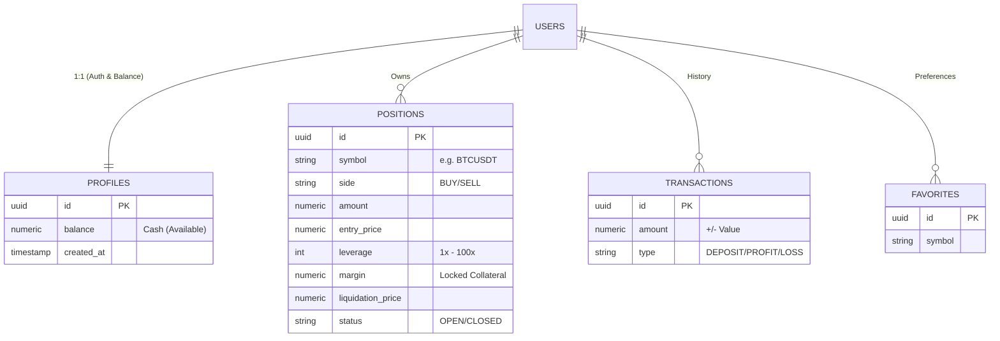

# CryptoBroker

Real-time cryptocurrency CFD trading platform. Trade 100+ crypto pairs with up to 50x leverage using a demo account with live Binance market data.

## Features

**Real-Time Trading** — Live prices streamed via Binance WebSocket (batch ticker for all symbols + individual ticker for the active pair). Open long/short CFD positions with 50x leverage and configurable stop-loss/take-profit. Spread (0.03%) applied to execution prices. Atomic trade execution and settlement via Supabase RPCs.

**Portfolio Management** — Live equity, used margin, available capital, and unrealized P&L recalculated on every price tick. Automatic SL/TP execution when price targets are hit. Margin call system closes positions (smallest first) when available capital drops to zero. Full position history with per-trade and per-symbol performance breakdown.

**Charting** — TradingView Lightweight Charts with candlestick, line, area, and bar modes across seven timeframes (1m, 5m, 15m, 1h, 4h, 1d, 1w). OHLC data from the Binance Klines API. Click any open position's symbol to instantly switch the chart to that pair.

**Economic Calendar** — Real-time macroeconomic events powered by RapidAPI (HorizonFX). Shows event name, country, currency, impact level (High/Medium/Low), and actual/forecast/previous values. Grouped currency filters (Major, Commodity, Emerging), impact filters, and date range presets (Yesterday through Next Week) plus a custom date picker with calendar UI. All filter selections persist in localStorage via Zustand. Server-side cache (30 min) keeps API usage well within the free tier (~500 req/month).

**Account & Auth** — Email/password authentication via Supabase Auth (PKCE flow). Password reset with secure callback handling. Demo account with configurable deposits (up to $100k). Account statistics dashboard with win rate, best/worst trade, volume, and symbol breakdown.

**UI/UX** — Dark and light themes via CSS variables and `next-themes`. Favorites with optimistic updates. Symbol search with gainers/losers/favorites tabs. Toast notifications for trade events. Responsive layout with Tailwind CSS 4.

## Tech Stack

| Layer | Technology |
|-------|-----------|
| Framework | Next.js 16 (App Router, Server Actions) |
| UI | React 19, Tailwind CSS 4 |
| State | Zustand 5 (with `persist` middleware for notifications & calendar filters) |
| Backend | Supabase (Auth, Postgres, RLS, Realtime, RPCs) |
| Market Data | Binance REST API + WebSocket streams |
| Economic Data | RapidAPI HorizonFX Economic Calendar |
| Charts | TradingView Lightweight Charts |
| Validation | Zod 4 |
| Data Fetching | TanStack React Query |

## Project Structure

```
app/
  (auth)/                 Auth pages (login, register, forgot-password, reset-password)
  auth/                   Auth callback route + server actions
  actions/                Server actions
    trade/                  execute-trade, close-position, update-order
    account/                get-account-stats, add-demo-funds, change-password
    favorites.ts            add/remove favorite symbols
    economic-calendar.ts    server action wrapping fetchEconomicCalendar
  market/                 Main trading dashboard
    _components/
      _symbols/             Symbol list, search, tabs, row
      _primaryContent/
        _chart/               TradingView chart + order panel
        _positionsPanel/      Open/closed positions, account info, edit modal
      _navbar/
        _economicCalendar/    Calendar panel, filters, date picker, data hook
      _header/              Dashboard header
  _components/            Headless components (AccountManager, MarketManager)
  api/                    API routes (Binance ticker proxy)

lib/
  binance.ts              Binance REST helpers (ticker, klines)
  economic-calendar.ts    RapidAPI economic calendar fetch + cache
  config.ts               Constants (spread, leverage, rate limits, URLs)
  trading-math.ts         P&L, margin, liquidation, SL/TP calculations
  rate-limit.ts           In-memory sliding-window rate limiter
  store.ts                Zustand store (market data, account state, notifications)
  schemas.ts              Zod validation schemas
  utils.ts                Formatting helpers
  supabase/
    client.ts               Browser-side Supabase client (singleton)
    server.ts               Server-side Supabase client (cookie-based)
    middleware.ts            Session refresh + auth routing
```

## Getting Started

### Prerequisites

Node.js 18+ and a Supabase project with the required tables, RPCs, and RLS policies (see Database section below).

### Environment Variables

Create a `.env.local` file:

```env
NEXT_PUBLIC_SUPABASE_URL=your_supabase_url
NEXT_PUBLIC_SUPABASE_ANON_KEY=your_supabase_anon_key
RAPIDAPI_KEY=your_rapidapi_key
```

The `RAPIDAPI_KEY` is required for the Economic Calendar. Get a free key at [rapidapi.com](https://rapidapi.com) and subscribe to the [HorizonFX Economic Calendar API](https://rapidapi.com/yasimpratama88/api/economic-calendar-api) (free tier, no credit card required).

### Install & Run

```bash
npm install
npm run dev
```

The app runs at `http://localhost:3000`.

### Production Build

```bash
npm run build
npm start
```

---

## Database Schema & Architecture

The platform uses PostgreSQL via Supabase, designed for financial integrity, leverage management, and strict data segregation with Row Level Security.

### Entity Relationship Diagram


```mermaid
erDiagram
    USERS ||--|| PROFILES : "1:1 (Auth & Balance)"
    USERS ||--o{ POSITIONS : "Owns"
    USERS ||--o{ TRANSACTIONS : "History"
    USERS ||--o{ FAVORITES : "Preferences"

    PROFILES {
        uuid id PK
        numeric balance "Cash (Available)"
        timestamp created_at
    }

    POSITIONS {
        uuid id PK
        string symbol "e.g. BTCUSDT"
        string side "BUY/SELL"
        numeric amount
        numeric entry_price
        int leverage "1x - 100x"
        numeric margin "Locked Collateral"
        numeric liquidation_price
        string status "OPEN/CLOSED"
    }

    TRANSACTIONS {
        uuid id PK
        numeric amount "+/- Value"
        string type "DEPOSIT/PROFIT/LOSS"
    }

    FAVORITES {
        uuid id PK
        string symbol
    }
```

---

### Table Reference

#### 1. `profiles`

Single source of truth for the user's cash balance. Updated automatically via database triggers.

| Column | Type | Description |
| --- | --- | --- |
| `id` | `uuid` (PK) | Links 1:1 with `auth.users`. |
| `balance` | `numeric` | Cash balance (excludes unrealized P&L). |
| `created_at` | `timestamptz` | Account creation timestamp. |

#### 2. `positions`

Active and historical CFD trades. The frontend `AccountManager` uses rows with `status='OPEN'` to calculate real-time equity and free margin.

| Column | Type | Description |
| --- | --- | --- |
| `id` | `uuid` (PK) | Unique position ID. |
| `user_id` | `uuid` (FK) | Owner. |
| `symbol` | `text` | Asset pair (e.g., `ETHUSDT`). |
| `side` | `text` | `'BUY'` (long) or `'SELL'` (short). |
| `amount` | `numeric` | Size in base asset. |
| `entry_price` | `numeric` | Execution price at open. |
| `leverage` | `int` | Leverage multiplier. |
| `margin` | `numeric` | Locked collateral: `(amount * entry_price) / leverage`. |
| `liquidation_price` | `numeric` | Stop-out price calculated at entry. |
| `take_profit` | `numeric` | Auto-close target (optional). |
| `stop_loss` | `numeric` | Max loss target (optional). |
| `status` | `text` | `'OPEN'` or `'CLOSED'`. |
| `pnl` | `numeric` | Realized P&L (populated on close). |
| `exit_price` | `numeric` | Execution price at close. |

#### 3. `transactions`

Immutable ledger of all financial movements. Read-only for users — only the system inserts rows.

| Column | Type | Description |
| --- | --- | --- |
| `id` | `uuid` (PK) | Unique transaction ID. |
| `user_id` | `uuid` (FK) | Owner. |
| `amount` | `numeric` | Negative for loss/withdraw, positive for profit/deposit. |
| `type` | `text` | `'DEPOSIT'`, `'WITHDRAWAL'`, `'REALIZED_PNL'`, `'FUNDING_FEE'`. |
| `reference_id` | `uuid` | Position ID that generated this event (optional). |
| `created_at` | `timestamptz` | Ledger timestamp. |

#### 4. `favorites`

User watchlist. Unique constraint on `(user_id, symbol)`.

| Column | Type | Description |
| --- | --- | --- |
| `id` | `uuid` (PK) | Unique ID. |
| `user_id` | `uuid` (FK) | Owner. |
| `symbol` | `text` | Symbol identifier. |

---

### Security & RLS

Row Level Security ensures no user can access another user's financial data:

- **`profiles`** — Users can view their own profile. Balance updates are restricted to system triggers.
- **`positions`** — Full CRUD on own positions only.
- **`transactions`** — Read-only access to own history.
- **`favorites`** — Full CRUD for the owner.

---

### Automation & Triggers

The `balance` field in `profiles` is never updated directly by the client. Instead, a database trigger keeps it consistent:

**Trigger: `on_transaction_created`** — Fires `AFTER INSERT` on `transactions` and atomically updates the user's balance:

```plpgsql
UPDATE public.profiles
SET balance = balance + NEW.amount
WHERE id = NEW.user_id;
```

This eliminates race conditions and guarantees balance is always the sum of the transaction history.

---

### SQL Setup

<details>
<summary>Full SQL setup script</summary>

```sql
-- 1. Enable UUID extension
create extension if not exists "uuid-ossp";

-- 2. Profiles Table (Linked to Auth)
create table public.profiles (
  id uuid references auth.users not null primary key,
  email text,
  balance numeric default 0 not null,
  created_at timestamp with time zone default timezone('utc'::text, now()) not null
);
alter table public.profiles enable row level security;

-- 3. Positions Table (Active Trading)
create table public.positions (
  id uuid default gen_random_uuid() primary key,
  user_id uuid references auth.users(id) not null,
  symbol text not null,
  side text not null check (side in ('BUY', 'SELL')),
  amount numeric not null,
  entry_price numeric not null,
  leverage int not null default 1,
  margin numeric not null,
  liquidation_price numeric,
  take_profit numeric,
  stop_loss numeric,
  exit_price numeric,
  pnl numeric,
  status text not null default 'OPEN',
  created_at timestamp with time zone default timezone('utc'::text, now()) not null,
  closed_at timestamp with time zone
);
alter table public.positions enable row level security;

-- 4. Transactions Table (Ledger)
create table public.transactions (
  id uuid default gen_random_uuid() primary key,
  user_id uuid references auth.users(id) not null,
  amount numeric not null,
  type text not null,
  reference_id uuid,
  created_at timestamp with time zone default timezone('utc'::text, now()) not null
);
alter table public.transactions enable row level security;

-- 5. Favorites Table (Watchlist)
create table public.favorites (
  id uuid default gen_random_uuid() primary key,
  user_id uuid references auth.users(id) on delete cascade not null,
  symbol text not null,
  created_at timestamp with time zone default timezone('utc'::text, now()) not null,
  unique(user_id, symbol)
);
alter table public.favorites enable row level security;

-- 6. Policies (Security)
create policy "Users can view own profile" on public.profiles for select using (auth.uid() = id);
create policy "Users can view own positions" on public.positions for select using (auth.uid() = user_id);
create policy "Users can insert own positions" on public.positions for insert with check (auth.uid() = user_id);
create policy "Users can update own positions" on public.positions for update using (auth.uid() = user_id);
create policy "Users can view own transactions" on public.transactions for select using (auth.uid() = user_id);
create policy "Users can manage favorites" on public.favorites for all using (auth.uid() = user_id);

-- 7. Trigger for Automatic Balance Updates
create or replace function public.handle_new_transaction()
returns trigger as $$
begin
  update public.profiles
  set balance = balance + NEW.amount
  where id = NEW.user_id;
  return NEW;
end;
$$ language plpgsql security definer;

create trigger on_transaction_created
after insert on public.transactions
for each row execute function public.handle_new_transaction();
```

</details>

## License

Private project.
